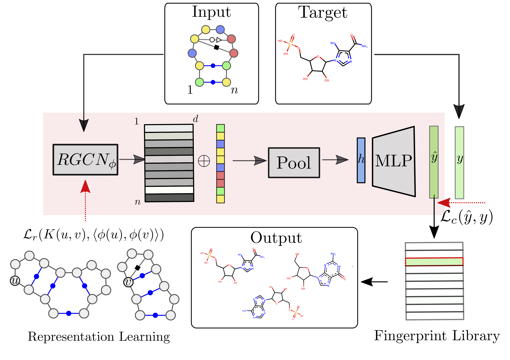

# RNAmigos: RNA Small Molecule Ligand Prediction

This repository is an implementation of ligand prediction from an RNA base pairing network.

> Augmented base pairing networks encode RNA-small molecule binding preferences. 
> Oliver C., Mallet V., Sarrazin Gendron, R., Reinharz V., Hamilton L W., Moitessier N., Waldispuhl J.
> BiorXiv, 2020.
> [[Paper]](https://www.biorxiv.org/content/10.1101/701326v3)

We implement three major components:

* `data_processor`: building a training set
* `learning`: RGCN training
* `tools`: general tools such as graph drawing, loading, etc.
* `post`: validation and visualization of results 

See README in each folder for details on how to use each component.

## Requirements

* Python >= 3.6
* Pytorch
* dgl
* OpenBabel
* BioPython
* tqdm

